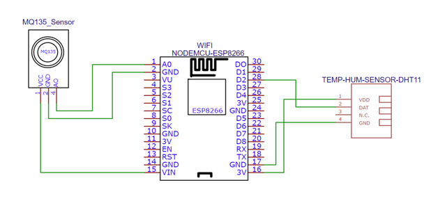
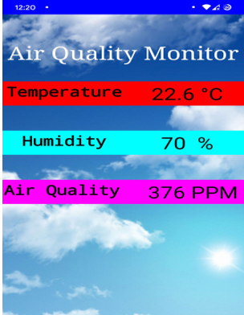
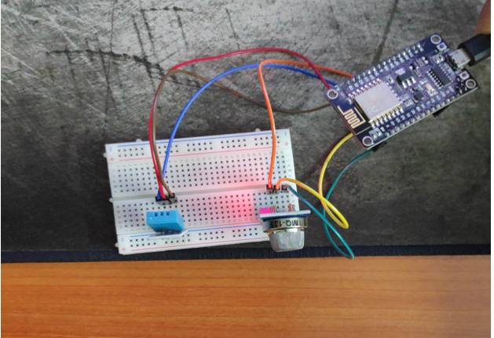

# CSE-299
This project presents a low-cost, portable IoT-based indoor air quality monitoring system designed to measure environmental parameters such as temperature, humidity, and harmful gases (NH₃, NOₓ, CO₂, benzene, alcohol, and smoke) in real-time. The system uses a NodeMCU ESP8266 microcontroller integrated with MQ-135 and DHT11 sensors and communicates with a custom-built Android app via Firebase Realtime Database for live monitoring. Built using MIT App Inventor, the app displays sensor data to help users ensure a healthy indoor environment. The total system cost is under BDT 1500, making it highly affordable compared to commercial alternatives.

## 📷 Project Images

### Figure 1: System Architecture Diagram

  

---

### Figure 2: Android App Interface Preview

  

---

### Figure 3: Final IoT Device Prototype

  

